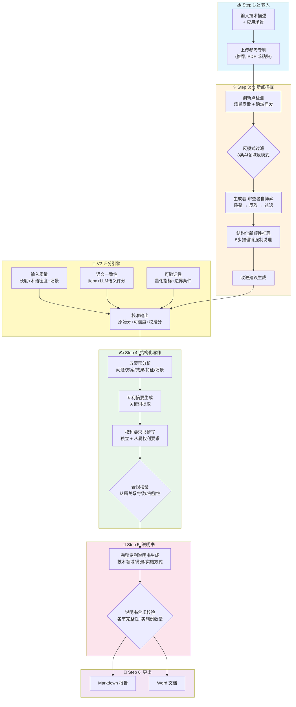
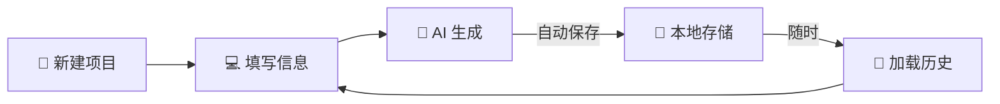

# AI 专利助手 v2.0

从技术描述到完整专利文档，逐步引导生成。

## 快速开始

```bash
# 1. 安装依赖
pip install -r requirements.txt

# 2. 启动应用（API Key 在界面侧边栏配置）
streamlit run app.py
```

## 使用流程



**6 步向导，每一步都能回退修改：**

1. **输入技术描述**：详细描述你的技术方案，并提供至少 1 个应用场景
2. **上传参考专利**（可选）：上传 1-3 篇相似专利 PDF 或粘贴文本，AI 会分析差异
3. **创新点挖掘**：AI 基于场景发散创新点，评估新颖性，生成改进建议
4. **五要素 & 摘要 & 权利要求**：自动生成专利五要素分析、摘要和权利要求书
5. **专利说明书**：生成完整的专利说明书
6. **导出报告**：导出为 Markdown 或 Word 文档

## 支持的 LLM

任何 OpenAI 兼容的 API 均可使用，在侧边栏配置即可切换：

| 提供商 | API URL | 模型名称 |
|--------|---------|----------|
| DeepSeek | `https://api.deepseek.com/v1/chat/completions` | `deepseek-chat` |
| 智谱 GLM | `https://open.bigmodel.cn/api/paas/v4/chat/completions` | `glm-4` |
| 通义千问 | `https://dashscope.aliyuncs.com/compatible-mode/v1/chat/completions` | `qwen-plus` |
| OpenAI | `https://api.openai.com/v1/chat/completions` | `gpt-4o` |

## 项目结构

```
ai_patent/
├── app.py                  # Streamlit 主入口（55行，调用ui模块）
├── config.py               # 统一配置管理（Pydantic Settings）
├── core/                   # 核心基础设施
│   ├── llm_client.py       # LLM 客户端（结构化输出 + JSON Mode）
│   ├── output_schema.py    # Pydantic 输出模型定义
│   ├── prompt_loader.py    # Prompt 模板加载器
│   ├── session_manager.py  # 会话持久化管理
│   ├── scoring.py          # V2 评分引擎（jieba + LLM语义评分）
│   ├── validator.py        # 专利合规校验（纯规则）
│   └── anti_patterns.py    # AI领域反模式库（8条规则）
├── modules/                # 业务模块
│   ├── idea_mining/        # 创新点挖掘流水线（含自博弈机制）
│   ├── structured_writing/ # 五要素 → 摘要 → 权利要求
│   ├── patent_generator/   # 专利说明书生成
│   ├── patent_search/      # 参考专利 PDF/文本解析
│   └── presentation/       # 报告导出（Markdown + Word）
├── ui/                     # Streamlit UI 模块
│   ├── state.py            # Session State 管理
│   ├── sidebar.py          # 侧边栏（会话+配置+评分+进度）
│   ├── step1_input.py      # Step 1: 输入权利说明
│   ├── step2_search.py     # Step 2: 上传参考专利
│   ├── step3_mining.py     # Step 3: 创新点挖掘
│   ├── step4_writing.py    # Step 4: 五要素+摘要+权利要求
│   ├── step5_spec.py       # Step 5: 专利说明书
│   └── step6_export.py     # Step 6: 导出报告
├── prompts/                # Prompt 模板（8个 Markdown 文件）
├── sessions/               # 会话数据存储目录
└── output/                 # 导出文件存放目录
```

## 项目会话管理

每个专利项目都会自动保存到 `sessions/` 目录，支持：

- **自动保存**：每步生成完成后自动保存
- **手动保存**：侧边栏随时点击"💾 保存"
- **续写**：关闭页面后，下次打开可从历史项目中继续
- **历史记录**：保留最近 10 个项目，可随时加载或删除



## 版本对比

| 维度 | v1 | v2 | v3 (本次) |
|------|----|----|-----------|
| LLM 调用 | LangChain LLMChain（已废弃） | openai SDK 直调 | 同v2 |
| 输出解析 | 逐行字符串匹配 | Pydantic + JSON Mode | 同v2 |
| 创新挖掘 | 三步独立无串联 | 三步串联流水线 | **+自博弈+反模式+跨域启发** |
| 新颖性评估 | LLM给个分数 | LLM给个分数 | **5步推理链强制说理** |
| 一致性评分 | Jaccard词汇重叠 | Jaccard词汇重叠 | **jieba+LLM语义评分** |
| 合规校验 | 无 | 无 | **纯规则：从属关系/字数/完整性** |
| 参考专利 | 可选，无强制对比 | 可选，无强制对比 | **推荐，强制逐条对比差异** |
| app.py | 1012行单文件 | 1012行单文件 | **55行+8个ui模块** |
| 术语提取 | 正则匹配 | 正则匹配 | **jieba关键词提取** |
| 依赖数量 | 30+ 个 | 7 个 | 8 个（+jieba） |
